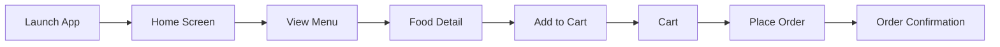
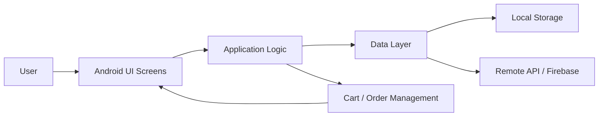

# RestaurantApp

A mobile restaurant management and food ordering application built as an Android portfolio project. The project demonstrates how an Android application can support common restaurant workflows such as browsing food items, viewing menu information, managing orders, and presenting a clean user interface for customers or restaurant staff.

This repository is part of my personal software development portfolio, focusing on Android application development, UI design, data handling, and practical mobile app features for a restaurant scenario.

---

## Project Overview

RestaurantApp is designed to simulate a real-world restaurant ordering application. The main purpose of the project is to show how a mobile app can organize restaurant data and provide a convenient user experience for browsing menu items and handling order-related actions.

The application can be used as a foundation for:

* digital restaurant menu browsing,
* food ordering workflows,
* restaurant product listing,
* cart and order management,
* customer-facing mobile UI,
* and mobile app portfolio demonstration.

The focus of this project is not only on building screens, but also on organizing an Android project in a way that is readable, maintainable, and suitable for future extension.

---

## Features

The application is designed around common restaurant app features:

* View restaurant food/menu items
* Display food details such as name, price, and description
* Organize menu items by category
* Support order/cart-oriented user flow
* Provide mobile-friendly UI screens
* Manage app navigation between pages
* Structure the project for future feature expansion

Depending on the final implementation, the project can be extended with:

* user authentication,
* admin menu management,
* order history,
* payment integration,
* Firebase or REST API backend,
* favorite foods,
* search and filtering,
* and restaurant dashboard features.

---

## Application Flow



The flow represents a typical restaurant ordering experience, where users can browse menu items, view food details, add items to a cart, and proceed with an order.

---

## Technology Stack

| Area                 | Technology                                    |
| -------------------- | --------------------------------------------- |
| Platform             | Android                                       |
| Programming Language | Java / Kotlin                                 |
| UI                   | XML Layouts / Android Views                   |
| IDE                  | Android Studio                                |
| Build Tool           | Gradle                                        |
| Architecture         | Activity / Fragment-based Android application |
| Data Handling        | Local data / API-ready structure              |
| Version Control      | Git, GitHub                                   |

> Note: Update this table based on the exact implementation of the project if the app uses Firebase, SQLite, Room, Retrofit, MVVM, Jetpack Compose, or another specific library.

---

## Repository Structure

A typical Android project structure is organized as follows:

```text
.
├── app/
│   ├── src/
│   │   ├── main/
│   │   │   ├── java/ or kotlin/
│   │   │   │   └── Application source code
│   │   │   ├── res/
│   │   │   │   ├── layout/        # UI layout files
│   │   │   │   ├── drawable/      # Images and drawable resources
│   │   │   │   ├── mipmap/        # App launcher icons
│   │   │   │   └── values/        # Colors, strings, themes
│   │   │   └── AndroidManifest.xml
│   │   │
│   └── build.gradle
│
├── build.gradle
├── settings.gradle
└── README.md
```

---

## Screens and Modules

The application can be organized into the following main screens:

| Screen                   | Description                                          |
| ------------------------ | ---------------------------------------------------- |
| Home Screen              | Entry screen for users to access restaurant features |
| Menu Screen              | Displays available food or drink items               |
| Food Detail Screen       | Shows detailed information about a selected item     |
| Cart Screen              | Displays selected items before ordering              |
| Order Screen             | Handles order confirmation or checkout flow          |
| Profile / Account Screen | Optional screen for user information                 |

This screen-based organization helps make the app easier to understand and maintain.

---

## Architecture

The following diagram illustrates the high-level Android application architecture, including user interface screens, application logic, data layer, and possible local or remote data sources.



The architecture follows a simple layered mobile application model, where the UI layer handles user interaction, the application logic manages behavior and navigation, and the data layer stores or retrieves restaurant information.

---

## Key Android Skills Demonstrated

This project demonstrates practical experience in:

* Android application development
* Mobile UI layout design
* Activity and screen navigation
* Restaurant menu and order flow modeling
* Resource management with Android `res/`
* Gradle-based Android project setup
* GitHub project documentation
* Structuring an app for future backend integration
* Building portfolio-ready mobile applications

---

## How to Run

### Prerequisites

Before running the project, install:

* Android Studio
* Android SDK
* JDK
* Gradle, or use the Gradle wrapper included in the project

### Steps

Clone the repository:

```bash
git clone https://github.com/hgiang25/RestaurantApp.git
cd RestaurantApp
```

Open the project in Android Studio:

```text
Android Studio → Open → Select RestaurantApp
```

Then:

1. Wait for Gradle sync to finish.
2. Select an Android emulator or physical device.
3. Click **Run**.
4. The application should build and launch on the selected device.

---

## Build

To build the project from the terminal:

```bash
./gradlew assembleDebug
```

On Windows PowerShell:

```powershell
.\gradlew.bat assembleDebug
```

The generated APK can usually be found under:

```text
app/build/outputs/apk/debug/
```

---

## Possible Improvements

Future improvements for this project include:

* Add authentication for customers and restaurant staff
* Add admin dashboard for managing menu items
* Add Firebase Realtime Database or Firestore integration
* Add Room database for offline data storage
* Add Retrofit API integration
* Add cart persistence
* Add order history
* Add search and category filtering
* Add payment gateway simulation
* Add push notifications for order status
* Improve UI/UX with Material Design components
* Add unit tests and UI tests
* Add screenshots or demo video to README

---

## Portfolio Notes

This project is included in my portfolio to demonstrate Android development skills through a practical restaurant application scenario.

The project highlights my ability to:

* design a mobile application flow,
* organize Android screens and resources,
* implement user-facing app features,
* document a project professionally,
* and prepare a mobile app for future backend and production-oriented improvements.

---

## Author

**Hoàng Giang**
Android / Mobile App Development / Software Engineering

This repository is part of my personal development portfolio, focusing on Android app development and practical mobile application design.
